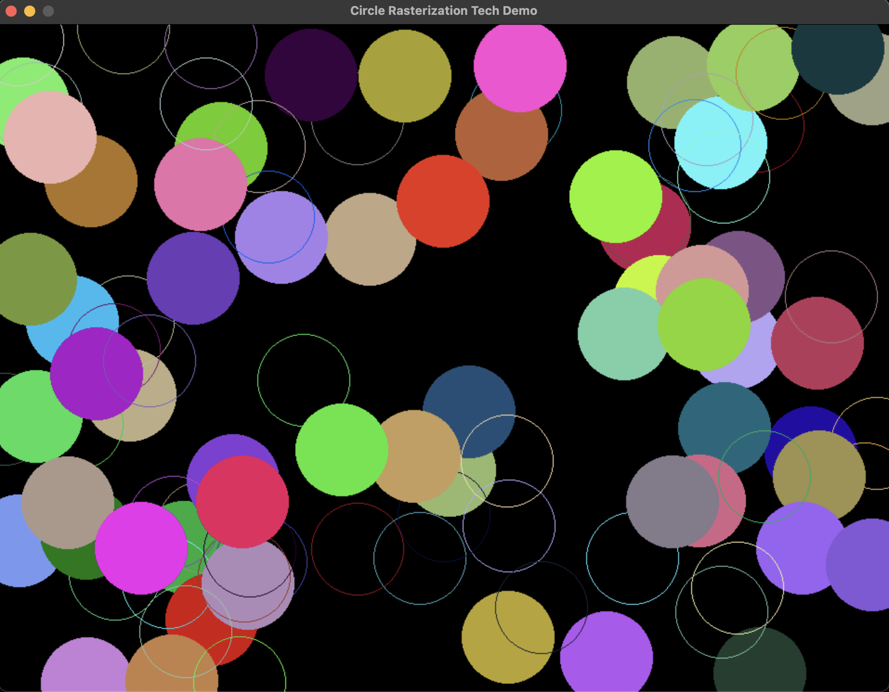

# circle-line-rasterization
Tech demo of naïve, bresenham and EFLA algorithms for circle and line (circle chord) rasterization.

Sources:
  - http://www.sunshine2k.de/coding/java/Bresenham/RasterisingLinesCircles.pdf
  - http://fredericgoset.ovh/mathematiques/courbes/en/bresenham_circle.html
  - http://www.edepot.com/algorithm.html

